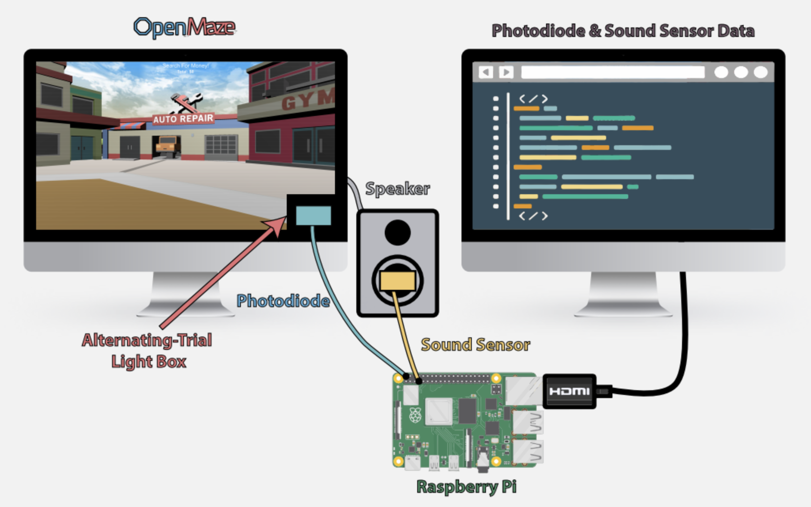

# OpenMaze Timing Library

This repository supports the main [OpenMaze](https://github.com/DuncanLab/OpenMaze) repository. 
The purpose of this repo is to detect and analyze timing discrepancies in between when OpenMaze displays an arbitrary trial on screen versus when the output file 'thinks' that a certain action happened. This was achieved by using a Raspberry Pi as a third party computer against the machine that OpenMaze was running on. 

In this repository you will find: 
* schematics for 3D your own Raspberry Pi sensor housing which adheres to the screen of the computer running OpenMaze
* Python code that creates log files from monitoring the OpenMaze software through the Raspberry Pi
* R code for conducting analysis on these output files.

## Getting Started

These instructions will get you a copy of the project up and running on your local machine for development and testing purposes.

### Prerequisites

What things you need to gt the project up and running: 

1. A Raspberry Pi with a photodiode sensor, a sound sensor, and a button. 
2. Python configured on the Raspberry Pi. (This should already be done, just make sure you have Python 3)
3. [R](https://www.r-project.org/) installed on the machine with which you plan to do analysis with. 

## Hardware Set Up

For a more detailed explanation of the hardware set up necessary for this project, please see the documentation [here](https://github.com/DuncanLab/OpenMaze-Timing/wiki/Raspberry-Pi-Set-Up). A breif overview is written below. 

After acquiring the needed sensors, use the 3D models in `/3D_prints` to create housings for your sound and light sensors. This is especially important for the light sensor as the housing blocks out irrelevant light that could lead to innacurate results.  

Next, hook up the button, sound sensor, and light sensor to your Raspberry Pi. The goal is to build a circuit structure that looks like the following: 



You can use whichever inputs you prefer, but the current code places sensors at the following pins: 

```
GPIO.setup(4, GPIO.IN) # photo sensor IN at pin 4
GPIO.setup(18, GPIO.IN) # sound sensor IN at pin 18
GPIO.setup(26, GPIO.IN, pull_up_down=GPIO.PUD_UP) # button input IN at pin 26
```

The last step is to attach the light sensor to the bottom right of the computer running OpenMaze. Double-sided tape is a great option, but you can use alternatives if needed.


### Installing

Begin by cloning this repository onto your Raspberry Pi and installing the following Python packages onto the Raspberry Pi. 

```
pip install pandas
pip install pygame
```

Next, clone this repository on the machine that you will be using for data analysis and make sure that you have R installed.

### Recording Data

Now that you have everything set up, the process for data collection and analysis is as follows. 

1. Make sure that OpenMaze is set up correctly with the alternating black square in the bottom right corner turned on. 
2. Run the Python script on the Raspberry Pi after attaching the light.
3. When you are ready, press the input button on the Raspberry Pi and the spacebar on the OpenMaze set up simultaneously to begin recording with the Raspberry Pi. (Note: perfect syncrony is not necessary for accurate results as between-trial time is the measured metric, it just makes things simpler when viewing the data)
4. When you have finished running your test OpenMaze configuration file, simply click the Raspberry Pi input button again and it will stop recording data and output a spreadsheet in `.xlsx` format. 

### Running Analysis: 

Running the analysis is quite straightforward, simply run the R script also included in the repo and make sure that it is pointing to the right `.xlsx` spreadsheets that you collected in the previous step. The goal of this script is to identify scientifically relevant lag in the Unity system depending on which environments are being used. 

Feel free to add any additional data analysis that you need and we recommend that you record test outputs with all of the environments that you plan on using for experimentation, as lag time differs depending on the elements in your scene. 

## Contributing

Please read our [contribution page](https://github.com/DuncanLab/OpenMaze-Timing/wiki/Contributing) for details on the process for submitting pull requests to us.

## Versioning

We use [SemVer](http://semver.org/) for versioning.

## Authors

* **Alex Gordienko** - *Initial work* - [Website](http://alexgordienko.com)
* **Kyle Nealy** - *Contributor* - [GitHub](https://github.com/AlexGordienko)

## License

This project is licensed under the MIT License.

